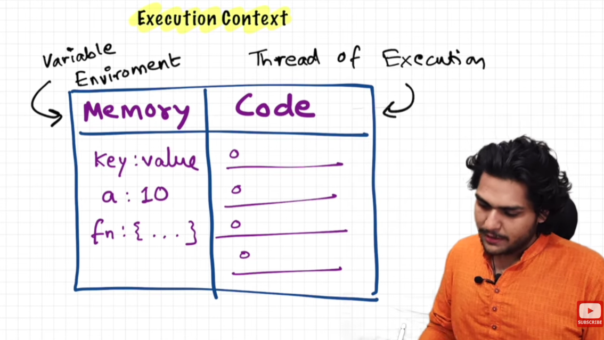

# JavaScript

## Execution context in JS



- Execution context is an environment/container in which JS code is executed.
- The container is consist of two phases: memory creation phase and code execution phase which are also called as —
    - memory → variable environment
    - code → thread of execution
- Memory consists of data in key-value pairs whereas code is consists of lines that are executed at the time of execution

> JS is a synchronous and single threaded language
> 
- Single threaded → can execute a single thread at a time
- Synchronous → can only execute one command at a time and in a certain order

> Everything in JS happens inside an execution context
> 

## How JS code is executed?


> In phase 1 (i.e. memory creation phase) :
> 


> In phase 2 (i.e. execution phase) :
> 

Note: For functions, separate execution context is created. 


After return statement, the execution will return to its last position/line of code.

The value for square2 function will be set to 4 and the whole execution context for function will be deleted.

In line number 7, function is being invoked with new value, so new execution context will be created once again.

## Call Stack

Call stack maintains the order of execution of execution contexts.

Call stack is also known as —

- Execution context stack
- Program stack
- Control stack
- Runtime stack
- Machine stack


## Hoisting in JS

Detailed Video : [https://youtu.be/Fnlnw8uY6jo](https://youtu.be/Fnlnw8uY6jo)

**Hoisting** is a JavaScript behavior where variable, function, and class **declarations** are “moved” to the top of their scope (such as a function or global space) before the code actually runs. This allows you, in some cases, to reference variables or functions even before they’re explicitly declared in code below.

### Variable Hoisting

- **With `var`**: The declaration is hoisted, but the initialization is not. If you use a **`var`** variable before its line of declaration, its value will be **`undefined`** until the code reaches the initialization.

### Function Hoisting

- **Function declarations** (**`function foo() {}`**) are fully hoisted, including the function body. This means you can call the function before it’s declared in your code.

## Functions in JS (❤️ of JS)

### Standard Functions

```jsx
function add(a, b) {
  return a + b;
}
```

### Arrow Functions

```jsx
const add = (a, b) => {a + b}
```

## Shortest JS Program

- Shortest JS program is an empty program. Even if nothing is there, it still performs multiple operations behind the scenes.
- When a JS program is run, a global execution context is created, a global object (window object) is created and a this object is created (this object points to window object)
- At global level, this equals to window object
    
    ```jsx
    // at global level only
    window === this
    true
    ```
    
- Anything not inside function is in global scope
- Whenever we add variables or functions in global scope, they are directly added to window object, whereas the variable inside functions are not added.
    - Very IMP ⬇️
        
        ```jsx
        let x = 10; // x is added to window object
        function abc(){ // abc is added to window object
            let y = 20; // y is not added to window object
        }
        console.log(window.a); // prints 10
        console.log(a); // prints 10
        console.log(this.a); // prints 10 (coz at global level, this = window)
        // IMP: anything which does not mention window as prefix is assumed as a global scope.
        ```
        

## `undefined` vs not defined

`undefined` means that the variable holds value but is not assigned yet whereas in not defined, value is not assigned throughout the whole program.

## Scope Chain and Lexical Environment

Detailed video : [https://youtu.be/uH-tVP8MUs8](https://youtu.be/uH-tVP8MUs8)

Lexical environment is local memory plus reference to lexical environment of parent i.e. child can access parent elements

The scope chain is the collective mechanism of lexical environments in which the child searches for parent’s environment if child doesn’t have the data.

## Let vs Var vs Const

Let and const declarations are hoisted

`let` and `const` are hoisted but remain uninitialized in the Temporal Dead Zone (TDZ) until their declaration is executed.

### **Hoisting for `var` vs `let` and `const`**

### **1. `var` is hoisted AND initialized with `undefined`**

This means you can use a `var` variable *before* its declaration (though it's bad practice):

```jsx
console.log(a); // undefined
var a = 10;

```

---

### **2. `let` and `const` are also hoisted, but NOT initialized**

They exist in memory but **cannot be accessed** before their declaration.

This creates the **Temporal Dead Zone (TDZ)** — the time between entering a scope and the variable’s declaration.

Example:

```jsx
console.log(b); // ❌ ReferenceError
let b = 20;

```

And:

```jsx
console.log(c); // ❌ ReferenceError
const c = 30;

```

They are hoisted, but you can’t use them until the interpreter reaches their declaration.

Temporal dead zone → It is the time between ‘the value of variable is undefined’ and ‘the value is assigned to variable’.

Avoid using `var`.

## Shadowing

```jsx
let a = 10;

function x(){
    let a = 99;
    const b = 29;
    var c = 69;
    console.log(a); // 99
    console.log(b); // 29
    console.log(c); // 69
}

x();
console.log(a); // 10
```

In the above code, a is re-declared in function x() which can also be called as inner `a` is shadowing outer `a`. Means, the variable inside function has its own value irrespective of its global value.

Note: We can shadow `let` using `let`, but we can’t shadow `let` using `var` but not vice-versa.

Note:

```jsx
const a = 10;
function b(){
    const a = 90; // valid
    console.log(a);
    
}
console.log(a);
b();
```

We can re-declare const inside functions because of shadowing

## Closures