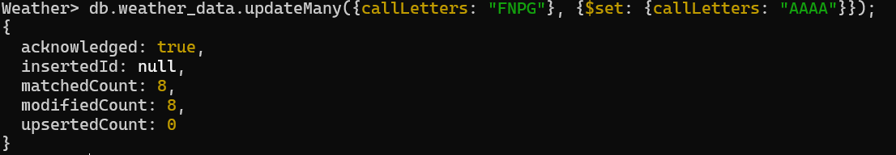
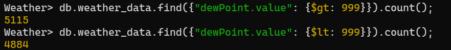
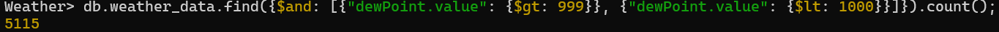
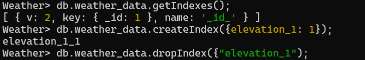

# MongoDB

# Prerequisites

## NoSQL

---

- NoSQL stands for NOT ONLY SQL
- NoSQL is a category of databases, which stores data in the non-relational fashion i.e. NoSQL generally does not store data in the form of tables.
- The name NoSQL is given because, in most of the NoSQL databases, we don’t write SQL like queries for inserting, deleting, updating and fetching data.
- Ex: MongoDB, CouchBase, Cassandra, ReThinkDB, etc.

## Types of NoSQL DBs

---

1. Graph Database → Ex: Neo4J
2. Key Value Database → Ex: Redis
3. Document Based Database → Ex: MongoDB
4. And many more…

## JSON

---

- JavaScript Object Notation
- JSON stores data in the form of objects like notation (i.e. key-values), not objects
- More 🔗 | [Read Article](https://www.mongodb.com/json-and-bson)

## BSON

---

- Binary JSON
- Data is stored in the form of Binary Format which basically increases the traversal speed of data

## Does MongoDB use JSON or BSON?

---

- MongoDB internally use BSON to store data, and externally JSON i.e. If we want to send or retrieve data, we can do that using JSON, but the data will be stored in BSON in tha database
- Using MongoDB Converter Drivers, JSON and BSON are converted according to the needs

# MongoDB

## Features

---

- In MongoDB, real life entity is represented by Collections
- What TABLE is for RDBMS is COLLECTIONS for MongoDB
- **Collections** is a group of JSON documents
- One record in collection is called as Document
- What ROW is for RDBMS is DOCUMENT for MongoDB
- Document is nothing but JSON (internally BSON)
- A JSON has multiple key-value pairs
- The key of JSON represents the property of the entity. So, what COLUMN is for RDBMS, KEY is for MongoDB
- NOTE: Semi-Colon is not mandatory in MongoDB

## 1. List all databases

---

```sql
show databases;
//OR
show dbs;
```

## 2. Select particular database

---

```sql
use database_name;
```

## 3. Printing the collections

---

```sql
show collections;
```

Make sure you run this command after entering to any database (i.e. `use db_name;`)

## 4. Print all the Documents

---

```sql
db.collection_name.find();
// Collection = Row
// Key = Column
```

## 5. Creating new Database

---

```sql
use database_name;
```

`use database_name` is used to switch between databases as well as create a new database if does not exist.

<aside>
💡 NOTE: Whenever a database is created, it is not listed when we try to run `show dbs;`. This is because, there is not valid data present in the collection of MongoDB.

</aside>

## 6. Adding a new collection

---

```sql
db.createCollection("NameOfTheCollection");
```

Make sure you run this command after entering to any database (i.e. `use db_name;`)

## 7. Adding records into collection

---

```sql
db.collectionName.insertOne({key1: value1, key2: value2, ...keyN: valueN});
// Example:
db.students.insertOne({name: "john", age: 19, job: "SDE-II"});
```

## 8. Adding multiple records into collection

---

```sql
db.students.insertMany([{name: "john", age: 19, job: "SDE-II"}, {name: "sam", age: 19, job: "SDE-I"}])
```

## 9. Adding array values in JSON

---

```sql
db.Student.insertOne({name: "David", skills: ["Web Development", "Java"]});
```

## 10. How to import sample databases? (Using MongoDB Compass)

---

- To get some sample datasets, go through the given link: [Link](https://github.com/neelabalan/mongodb-sample-dataset/tree/main/sample_weatherdata)
- Choose any folder of your choice
- Once the file is downloaded, you can use MongoDB Compass to import the database
- In MongoDB Compass, first of all connect to the server and then create a new database using “+” icon
- Give database a name and also a collection name
- After that, click on the “Add Data” button, and you’ll see 2 options are popped up, “Add JSON or CSV” and another “Insert Document”.
- Click on “Add JSON or CSV”
- Choose the dataset (.JSON) from its location and import it using “Import” option
- Done. Now, you can check using `show dbs;` and use it in the Mongo Shell as well

## 11. How to import sample databases? (Using MongoDB Shell)

---

- Open command prompt
- Change directory (e.g. cd Downloads) to the location where the JSON file is located
- Now, we can use a tool called `mongoimport` which is provided by MongoDB at the time of installation
- Following is the command to import using Shell
    
    ```sql
    mongoimport --db db_name --collection collection_name --file file_name.json;
    // Ex:
    mongoimport --db Weather --collection Weather_Data --file weather_data.json;
    ```
    

## 12. Finding Count/Number of Documents in a Collection

---

```sql
db.collection_name.find().count();
// Ex:
db.weather_data.find().count();
```

## 13. How to Handle Printing Huge Amount of Data

---

- Whenever there is a huge database, MongoDB Shell does not print all the database when we use `find()` command, instead, it prints some of them and if we want to access the rest, then we’ll have to type `it`.

## 14. Printing Certain No. of Documents (Using LIMIT)

---

```sql
db.collection_name.find().limit(10);
// Ex:
db.weather_data.find().limit(30);
```

## 15. Setting Offset using SKIP (Link Pagination)

---

- `skip` function is used to set an offset

```sql
db.collection_name.find().skip(10).limit(2);
```

## 16. Filtering Documents in Collection

---

- Conditions are passed in the `find()` function using key-value pairs

```sql
db.collectionName.find({key1: value1, key2: value2 ... keyN: valueN});
```

## 17. Projections

---

- If we want to not get all the properties of the JSON, and instead get some specific key-value pairs, this process is called as projections. In the world of SQL, if you do `SELECT * FROM TABLE` then, you get all the columns but if you do, `SELECT NAME, ADDRESS FROM TABLE` you only get name and address. This same thing is achieved in MongoDB using Projections.
- In `find()` function, the first object is used as a filtrator. It also may contain a second object, which contains the desired properties we want to give. It is done by using the property name and assigning it `true` value.

```sql
db.collection_name.find({key: value}, {property1: true, property: true});
// Ex:
db.weather_data.find({type: "FM-13"}, {visibility: true, position: true});
```

- First argument can be empty in the JSON object, i.e. we can write the above code also as:

```sql
db.weather_data.find({}, {visibility: true, position: true});
```

- Now, if we want to exclude certain properties and access rest of them, then, we assign them a `false` value

```sql
db.weather_data.find(visibility: false, position: false);
```

- Now, this command will everything except the `false`'ly mentioned values

## Deleting Documents

---

- If we want to delete documents, we can use functions like `deleteOne`, `deleteMany` and `findByIdAndDelete`.
1. `deleteOne`
    
    ```sql
    db.collection_name.deleteOne({key: value});
    // Ex:
    db.weather_data.deleteOne({st: "x+43400-065600"});
    ```
    
2. `deleteMany`
    
    ```sql
    db.collection_name.deleteMany({key: value});
    // Ex:
    db.weather_data.deleteMany({callLetters: "FNPG"});
    ```
    
3. `deleteOneAndDelete`
    - This function is used to fetch all the records and delete only one record
    
    ```sql
    db.weather_data.deleteOneAndDelete({callLetters: "FNPG"});
    ```
    

## Updating Records

---

1. `updateOne`
    - It accepts 2 arguments, one for fetching the document and second for updating the record
    - In MongoDB, opereators are pre-appended using `$` sign
    1. `$set`
        
        ```sql
        db.collection_name.updateOne({key: value}, {$operator: {key: value}});
        // Ex:
        db.weather_data.updateOne({_id: ObjectId('5553a998e4b02cf7151190b8')}, {$set: {elevation: 9988}});
        ```
        
    2. `$inc`
        - It is used to increment the value of the provided data.
        - The number of incrementing should be defined after `$inc`
        
        ```sql
        db.weather_data.updateOne({_id: ObjectId('5553a998e4b02cf7151190b8')}, {$inc: {elevation: 1}});
        ```
        
    3. `$inc` for decrementing
        - We can assign -1 value to the `$inc` operator because, decrement operator doesn’t exist in MongoDB.
        
        ```sql
        db.weather_data.updateOne({_id: ObjectId('5553a998e4b02cf7151190b8')}, {$inc: {elevation: -1}});
        ```
        
2. `updateMany`
    - updateMany is used to update values of the records complying of the same filtration criteria
        
        ```sql
        db.weather_data.updateMany({callLetters: "FNPG"}, {$set: {callLetters: "AAAA"}});
        ```
        
        
        
    
    ## Finding out Distinct Values
    
    ---
    
    - This keyword is used to find out the distinct values (i.e. unique values) in a key using `distinct` keyword.
        
        ```sql
        db.collectionName.distinct("key");
        Ex:
        db.weather_data.distinct("callLetters");
        ```
        
    
    ## Operators in MongoDB
    
    ---
    
    - MongoDB provides different comparison, logical, bitwise, etc operators.
        
        ### Finding records that are not equal to the specified condition (`$ne`)
        
        ```sql
        db.collectionName.find({type: {$ne: "FM-13"}});
        ```
        
    - Commonly used operators:
        1. $ne → not equals
        2. $eq → equals
        3. $lt → less than
        4. $lte → less than or equals to
        5. $gt → greater than
        6. $gte → greater than or equals to
            
            
            
        7. $and → logical AND
            
            
            
        8. $or → logical OR
        9. $not → logical NOT
        10. $nor → logical NOR
        11. $in → for checking in an array
        12. $nin → not in array
    
    ## Analysing Queries
    
    ---
    
    - We can analyze our queries using the `explain` function. Inside this function, we can pass an argument called `executionStats` and it will provide us the details.
        
        ```sql
        db.collectionName.find({key: value}).explain("executionStats");
        // Ex: 
        db.weather_data.find({type: "SAO"}).explain("executionStats");
        ```
        
        Output:
        
        ```json
        {
          explainVersion: '2',
          queryPlanner: {
            namespace: 'Weather.weather_data',
            indexFilterSet: false,
            parsedQuery: { type: { '$eq': 'SAO' } },
            queryHash: '148B1959',
            planCacheKey: '90C1C0BF',
            maxIndexedOrSolutionsReached: false,
            maxIndexedAndSolutionsReached: false,
            maxScansToExplodeReached: false,
            winningPlan: {
              queryPlan: {
                stage: 'COLLSCAN',
                planNodeId: 1,
                filter: { type: { '$eq': 'SAO' } },
                direction: 'forward'
              },
              slotBasedPlan: {
                slots: '$$RESULT=s5 env: { s1 = TimeZoneDatabase(Africa/Lome...Europe/Kaliningrad) (timeZoneDB), s3 = 1703930679885 (NOW), s2 = Nothing (SEARCH_META), s7 = "SAO" }',
                stages: '[1] filter {traverseF(s4, lambda(l1.0) { ((l1.0 == s7) ?: false) }, false)} \n' +
                  '[1] scan s5 s6 none none none none lowPriority [s4 = type] @"8a8352d0-91a0-4758-af41-8231fec63eb3" true false '
              }
            },
            rejectedPlans: []
          },
          executionStats: {
            executionSuccess: true,
            nReturned: 6,
            executionTimeMillis: 11,
            totalKeysExamined: 0,
            totalDocsExamined: 9999,
            executionStages: {
              stage: 'filter',
              planNodeId: 1,
              nReturned: 6,
              executionTimeMillisEstimate: 10,
              opens: 1,
              closes: 1,
              saveState: 10,
              restoreState: 10,
              isEOF: 1,
              numTested: 9999,
              filter: 'traverseF(s4, lambda(l1.0) { ((l1.0 == s7) ?: false) }, false) ',
              inputStage: {
                stage: 'scan',
                planNodeId: 1,
                nReturned: 9999,
                executionTimeMillisEstimate: 10,
                opens: 1,
                closes: 1,
                saveState: 10,
                restoreState: 10,
                isEOF: 1,
                numReads: 9999,
                recordSlot: 5,
                recordIdSlot: 6,
                fields: [ 'type' ],
                outputSlots: [ Long('4') ]
              }
            }
          },
          command: { find: 'weather_data', filter: { type: 'SAO' }, '$db': 'Weather' },
          serverInfo: {
            host: 'LAPTOP-75SPSDI0',
            port: 27017,
            version: '7.0.4',
            gitVersion: '38f3e37057a43d2e9f41a39142681a76062d582e'
          },
          serverParameters: {
            internalQueryFacetBufferSizeBytes: 104857600,
            internalQueryFacetMaxOutputDocSizeBytes: 104857600,
            internalLookupStageIntermediateDocumentMaxSizeBytes: 104857600,
            internalDocumentSourceGroupMaxMemoryBytes: 104857600,
            internalQueryMaxBlockingSortMemoryUsageBytes: 104857600,
            internalQueryProhibitBlockingMergeOnMongoS: 0,
            internalQueryMaxAddToSetBytes: 104857600,
            internalDocumentSourceSetWindowFieldsMaxMemoryBytes: 104857600,
            internalQueryFrameworkControl: 'trySbeEngine'
          },
          ok: 1
        }
        ```
        
    
    ## Indexing
    
    ---
    
    - Indexes support efficient execution of queries in MongoDB. Without indexes, MongoDB must scan every document in a collection to return query results. If an appropriate index exists for a query, MongoDB uses the index to limit the number of documents it must scan.
    - Indexing is a mechanism using which databases prepares more data structures to store data in a particular order based on particular keys for faster search.
        
        ### 1. Listing all Indexes
        
        ```jsx
        db.collectionName.getIndexes();
        // Ex:
        db.weather_data.getIndexes();
        ```
        
        ### 2. Deleting an Existing Index
        
        ```jsx
        db.collection_name.dropIndex("index_name");
        // Ex:
        db.weather_data.dropIndex("elevation_1");
        ```
        
        ### 3. Creating a New Index
        
        ```jsx
        db.collectionName.createIndex({indexName: value});
        // Ex:
        db.weather_data.createIndex({elevation_1: 1});
        ```
        
        
        
        ### 4. Analysing Index after Creating It
        
        - Before we created index on the `elevation` property, we were reading all the docs i.e. approx. 9991 docs to search only 1 element with elevation less than 9999.
        - After using Indexes
            
            ```json
            Weather> db.weather_data.find({elevation: {$lt: 9999}}).explain("executionStats");
            {
              explainVersion: '2',
              queryPlanner: {
                namespace: 'Weather.weather_data',
                indexFilterSet: false,
                parsedQuery: { elevation: { '$lt': 9999 } },
                queryHash: '48238B16',
                planCacheKey: 'F5463247',
                maxIndexedOrSolutionsReached: false,
                maxIndexedAndSolutionsReached: false,
                maxScansToExplodeReached: false,
                winningPlan: {
                  queryPlan: {
                    stage: 'FETCH',
                    planNodeId: 2,
                    inputStage: {
                      stage: 'IXSCAN',
                      planNodeId: 1,
                      keyPattern: { elevation: 1 },
                      indexName: 'elevation_1',
                      isMultiKey: false,
                      multiKeyPaths: { elevation: [] },
                      isUnique: false,
                      isSparse: false,
                      isPartial: false,
                      indexVersion: 2,
                      direction: 'forward',
                      indexBounds: { elevation: [ '[-inf.0, 9999)' ] }
                    }
                  },
                  slotBasedPlan: {
                    slots: '$$RESULT=s11 env: { s6 = KS(2C4E1E0104), s1 = TimeZoneDatabase(Africa/Lome...Europe/Kaliningrad) (timeZoneDB), s5 = KS(1F00000000000000000104), s2 = Nothing (SEARCH_META), s3 = 1703946319012 (NOW), s10 = {"elevation" : 1} }',
                    stages: '[2] nlj inner [] [s4, s7, s8, s9, s10] \n' +
                      '    left \n' +
                      '        [1] cfilter {(exists(s5) && exists(s6))} \n' +
                      '        [1] ixseek s5 s6 s9 s4 s7 s8 [] @"8a8352d0-91a0-4758-af41-8231fec63eb3" @"elevation_1" true \n' +
                      '    right \n' +
                      '        [2] limit 1 \n' +
                      '        [2] seek s4 s11 s12 s7 s8 s9 s10 [] @"8a8352d0-91a0-4758-af41-8231fec63eb3" true false \n'
                  }
                },
                rejectedPlans: []
              },
              executionStats: {
                executionSuccess: true,
                nReturned: 1,
                executionTimeMillis: 1,
                totalKeysExamined: 1,
                totalDocsExamined: 1,
                executionStages: {
                  stage: 'nlj',
                  planNodeId: 2,
                  nReturned: 1,
                  executionTimeMillisEstimate: 0,
                  opens: 1,
                  closes: 1,
                  saveState: 0,
                  restoreState: 0,
                  isEOF: 1,
                  totalDocsExamined: 1,
                  totalKeysExamined: 1,
                  collectionScans: 0,
                  collectionSeeks: 1,
                  indexScans: 0,
                  indexSeeks: 1,
                  indexesUsed: [ 'elevation_1' ],
                  innerOpens: 1,
                  innerCloses: 1,
                  outerProjects: [],
                  outerCorrelated: [ Long('4'), Long('7'), Long('8'), Long('9'), Long('10') ],
                  outerStage: {
                    stage: 'cfilter',
                    planNodeId: 1,
                    nReturned: 1,
                    executionTimeMillisEstimate: 0,
                    opens: 1,
                    closes: 1,
                    saveState: 0,
                    restoreState: 0,
                    isEOF: 1,
                    numTested: 1,
                    filter: '(exists(s5) && exists(s6)) ',
                    inputStage: {
                      stage: 'ixseek',
                      planNodeId: 1,
                      nReturned: 1,
                      executionTimeMillisEstimate: 0,
                      opens: 1,
                      closes: 1,
                      saveState: 0,
                      restoreState: 0,
                      isEOF: 1,
                      indexName: 'elevation_1',
                      keysExamined: 1,
                      seeks: 1,
                      numReads: 2,
                      indexKeySlot: 9,
                      recordIdSlot: 4,
                      snapshotIdSlot: 7,
                      indexIdentSlot: 8,
                      outputSlots: [],
                      indexKeysToInclude: '00000000000000000000000000000000',
                      seekKeyLow: 's5 ',
                      seekKeyHigh: 's6 '
                    }
                  },
                  innerStage: {
                    stage: 'limit',
                    planNodeId: 2,
                    nReturned: 1,
                    executionTimeMillisEstimate: 0,
                    opens: 1,
                    closes: 1,
                    saveState: 0,
                    restoreState: 0,
                    isEOF: 1,
                    limit: 1,
                    inputStage: {
                      stage: 'seek',
                      planNodeId: 2,
                      nReturned: 1,
                      executionTimeMillisEstimate: 0,
                      opens: 1,
                      closes: 1,
                      saveState: 0,
                      restoreState: 0,
                      isEOF: 0,
                      numReads: 1,
                      recordSlot: 11,
                      recordIdSlot: 12,
                      seekKeySlot: 4,
                      snapshotIdSlot: 7,
                      indexIdentSlot: 8,
                      indexKeySlot: 9,
                      indexKeyPatternSlot: 10,
                      fields: [],
                      outputSlots: []
                    }
                  }
                }
              },
              command: {
                find: 'weather_data',
                filter: { elevation: { '$lt': 9999 } },
                '$db': 'Weather'
              },
              serverInfo: {
                host: 'LAPTOP-75SPSDI0',
                port: 27017,
                version: '7.0.4',
                gitVersion: '38f3e37057a43d2e9f41a39142681a76062d582e'
              },
              serverParameters: {
                internalQueryFacetBufferSizeBytes: 104857600,
                internalQueryFacetMaxOutputDocSizeBytes: 104857600,
                internalLookupStageIntermediateDocumentMaxSizeBytes: 104857600,
                internalDocumentSourceGroupMaxMemoryBytes: 104857600,
                internalQueryMaxBlockingSortMemoryUsageBytes: 104857600,
                internalQueryProhibitBlockingMergeOnMongoS: 0,
                internalQueryMaxAddToSetBytes: 104857600,
                internalDocumentSourceSetWindowFieldsMaxMemoryBytes: 104857600,
                internalQueryFrameworkControl: 'trySbeEngine'
              },
              ok: 1
            }
            ```
            
        - After using Indexes, you’ll notice that, the `docsExamined` will be much lesser as compared to the one search which does not use indexes.
        
        ### 5. Creating Indexes for Texts
        
        - Here the syntax is quite different for analysing string related queries
        - `$text`, `$search` is used in this process
            
            ```jsx
            db.collectionName.find({$text: {$search: "text"}}).explain("executionStats");
            // Ex:
            db.listingsAndReviews.find({$text: {$search: "United States"}}).explain("executionStats");
            ```
            
            - Before using Index
                
                ```json
                airbnb_db> db.listingsAndReviews.find({"address.country": "United States"}).explain("executionStats");
                {
                  explainVersion: '2',
                  queryPlanner: {
                    namespace: 'airbnb_db.listingsAndReviews',
                    indexFilterSet: false,
                    parsedQuery: { 'address.country': { '$eq': 'United States' } },
                    queryHash: '7F4E5F2D',
                    planCacheKey: 'B0EC20EB',
                    maxIndexedOrSolutionsReached: false,
                    maxIndexedAndSolutionsReached: false,
                    maxScansToExplodeReached: false,
                    winningPlan: {
                      queryPlan: {
                        stage: 'COLLSCAN',
                        planNodeId: 1,
                        filter: { 'address.country': { '$eq': 'United States' } },
                        direction: 'forward'
                      },
                      slotBasedPlan: {
                        slots: '$$RESULT=s5 env: { s2 = Nothing (SEARCH_META), s7 = "United States", s1 = TimeZoneDatabase(Africa/Lome...Europe/Kaliningrad) (timeZoneDB), s3 = 1703951431224 (NOW) }',
                        stages: '[1] filter {traverseF(s4, lambda(l1.0) { traverseF(getField(l1.0, "country"), lambda(l2.0) { ((l2.0 == s7) ?: false) }, false) }, false)} \n' +
                          '[1] scan s5 s6 none none none none lowPriority [s4 = address] @"53a606f6-6739-4f1c-bdb2-eefcbaa4d976" true false '
                      }
                    },
                    rejectedPlans: []
                  },
                  executionStats: {
                    executionSuccess: true,
                    nReturned: 1222,
                    executionTimeMillis: 17,
                    totalKeysExamined: 0,
                    totalDocsExamined: 5555,
                    executionStages: {
                      stage: 'filter',
                      planNodeId: 1,
                      nReturned: 1222,
                      executionTimeMillisEstimate: 15,
                      opens: 1,
                      closes: 1,
                      saveState: 5,
                      restoreState: 5,
                      isEOF: 1,
                      numTested: 5555,
                      filter: 'traverseF(s4, lambda(l1.0) { traverseF(getField(l1.0, "country"), lambda(l2.0) { ((l2.0 == s7) ?: false) }, false) }, false) ',
                      inputStage: {
                        stage: 'scan',
                        planNodeId: 1,
                        nReturned: 5555,
                        executionTimeMillisEstimate: 12,
                        opens: 1,
                        closes: 1,
                        saveState: 5,
                        restoreState: 5,
                        isEOF: 1,
                        numReads: 5555,
                        recordSlot: 5,
                        recordIdSlot: 6,
                        fields: [ 'address' ],
                        outputSlots: [ Long('4') ]
                      }
                    }
                  },
                  command: {
                    find: 'listingsAndReviews',
                    filter: { 'address.country': 'United States' },
                    '$db': 'airbnb_db'
                  },
                  serverInfo: {
                    host: 'LAPTOP-75SPSDI0',
                    port: 27017,
                    version: '7.0.4',
                    gitVersion: '38f3e37057a43d2e9f41a39142681a76062d582e'
                  },
                  serverParameters: {
                    internalQueryFacetBufferSizeBytes: 104857600,
                    internalQueryFacetMaxOutputDocSizeBytes: 104857600,
                    internalLookupStageIntermediateDocumentMaxSizeBytes: 104857600,
                    internalDocumentSourceGroupMaxMemoryBytes: 104857600,
                    internalQueryMaxBlockingSortMemoryUsageBytes: 104857600,
                    internalQueryProhibitBlockingMergeOnMongoS: 0,
                    internalQueryMaxAddToSetBytes: 104857600,
                    internalDocumentSourceSetWindowFieldsMaxMemoryBytes: 104857600,
                    internalQueryFrameworkControl: 'trySbeEngine'
                  },
                  ok: 1
                }
                ```
                
            - After using Index
                
                ```json
                airbnb_db> db.listingsAndReviews.find({$text: {$search: "United States"}}).explain("executionStats");
                {
                  explainVersion: '2',
                  queryPlanner: {
                    namespace: 'airbnb_db.listingsAndReviews',
                    indexFilterSet: false,
                    parsedQuery: {
                      '$text': {
                        '$search': 'United States',
                        '$language': 'english',
                        '$caseSensitive': false,
                        '$diacriticSensitive': false
                      }
                    },
                    queryHash: '5EA765FC',
                    planCacheKey: '5099BF95',
                    maxIndexedOrSolutionsReached: false,
                    maxIndexedAndSolutionsReached: false,
                    maxScansToExplodeReached: false,
                    winningPlan: {
                      queryPlan: {
                        stage: 'TEXT_MATCH',
                        planNodeId: 5,
                        indexPrefix: {},
                        indexName: 'address.country_text',
                        parsedTextQuery: {
                          terms: [ 'state', 'unit' ],
                          negatedTerms: [],
                          phrases: [],
                          negatedPhrases: []
                        },
                        textIndexVersion: 2,
                        inputStage: {
                          stage: 'FETCH',
                          planNodeId: 4,
                          inputStage: {
                            stage: 'OR',
                            planNodeId: 3,
                            inputStages: [
                              {
                                stage: 'IXSCAN',
                                planNodeId: 1,
                                keyPattern: { _fts: 'text', _ftsx: 1 },
                                indexName: 'address.country_text',
                                isMultiKey: true,
                                isUnique: false,
                                isSparse: false,
                                isPartial: false,
                                indexVersion: 2,
                                direction: 'backward',
                                indexBounds: {}
                              },
                              {
                                stage: 'IXSCAN',
                                planNodeId: 2,
                                keyPattern: { _fts: 'text', _ftsx: 1 },
                                indexName: 'address.country_text',
                                isMultiKey: true,
                                isUnique: false,
                                isSparse: false,
                                isPartial: false,
                                indexVersion: 2,
                                direction: 'backward',
                                indexBounds: {}
                              }
                            ]
                          }
                        }
                      },
                      slotBasedPlan: {
                        slots: '$$RESULT=s18 env: { s8 = {"_fts" : "text", "_ftsx" : 1}, s2 = Nothing (SEARCH_META), s1 = TimeZoneDatabase(Africa/Lome...Europe/Kaliningrad) (timeZoneDB), s3 = 1703951881740 (NOW) }',
                        stages: '[5] filter {\n' +
                          '    if isObject(s18) \n' +
                          '    then ftsMatch(FtsMatcher({"terms" : ["state", "unit"], "negatedTerms" : [], "phrases" : [], "negatedPhrases" : []}), s18) \n' +
                          '    else fail(4623400, "textmatch requires input to be an object") \n' +
                          '} \n' +
                          '[4] nlj inner [] [s14, s17, s15, s16, s13] \n' +
                          '    left \n' +
                          '        [3] unique [s14] \n' +
                          '        [3] union [s15, s16, s13, s14, s17] \n' +
                          '            branch0 [s6, s7, s8, s4, s5] \n' +
                          '                [1] unique [s4] \n' +
                          '                [1] ixseek KS(3C7374617465002E77359400FE04) KS(3C737461746500290104) s7 s4 s5 s6 [] @"53a606f6-6739-4f1c-bdb2-eefcbaa4d976" @"address.country_text" false \n' +
                          '            branch1 [s11, s12, s8, s9, s10] \n' +
                          '                [2] unique [s9] \n' +
                          '                [2] ixseek KS(3C756E6974002E77359400FE04) KS(3C756E697400290104) s12 s9 s10 s11 [] @"53a606f6-6739-4f1c-bdb2-eefcbaa4d976" @"address.country_text" false \n' +
                          '    right \n' +
                          '        [4] limit 1 \n' +
                          '        [4] seek s14 s18 s19 s17 s15 s16 s13 [] @"53a606f6-6739-4f1c-bdb2-eefcbaa4d976" true false \n'
                      }
                    },
                    rejectedPlans: []
                  },
                  executionStats: {
                    executionSuccess: true,
                    nReturned: 1222,
                    executionTimeMillis: 33,
                    totalKeysExamined: 2444,
                    totalDocsExamined: 1222,
                    executionStages: {
                      stage: 'filter',
                      planNodeId: 5,
                      nReturned: 1222,
                      executionTimeMillisEstimate: 22,
                      opens: 1,
                      closes: 1,
                      saveState: 3,
                      restoreState: 3,
                      isEOF: 1,
                      numTested: 1222,
                      filter: '\n' +
                        '    if isObject(s18) \n' +
                        '    then ftsMatch(FtsMatcher({"terms" : ["state", "unit"], "negatedTerms" : [], "phrases" : [], "negatedPhrases" : []}), s18) \n' +
                        '    else fail(4623400, "textmatch requires input to be an object") \n',
                      inputStage: {
                        stage: 'nlj',
                        planNodeId: 4,
                        nReturned: 1222,
                        executionTimeMillisEstimate: 22,
                        opens: 1,
                        closes: 1,
                        saveState: 3,
                        restoreState: 3,
                        isEOF: 1,
                        totalDocsExamined: 1222,
                        totalKeysExamined: 2444,
                        collectionScans: 0,
                        collectionSeeks: 1222,
                        indexScans: 0,
                        indexSeeks: 2,
                        indexesUsed: [ 'address.country_text', 'address.country_text' ],
                        innerOpens: 1222,
                        innerCloses: 1,
                        outerProjects: [],
                        outerCorrelated: [ Long('14'), Long('17'), Long('15'), Long('16'), Long('13') ],
                        outerStage: {
                          stage: 'unique',
                          planNodeId: 3,
                          nReturned: 1222,
                          executionTimeMillisEstimate: 22,
                          opens: 1,
                          closes: 1,
                          saveState: 3,
                          restoreState: 3,
                          isEOF: 1,
                          dupsTested: 2444,
                          dupsDropped: 1222,
                          keySlots: [ Long('14') ],
                          inputStage: {
                            stage: 'union',
                            planNodeId: 3,
                            nReturned: 2444,
                            executionTimeMillisEstimate: 20,
                            opens: 1,
                            closes: 1,
                            saveState: 3,
                            restoreState: 3,
                            isEOF: 1,
                            inputSlots: [
                              Long('6'),  Long('7'),
                              Long('8'),  Long('4'),
                              Long('5'),  Long('11'),
                              Long('12'), Long('8'),
                              Long('9'),  Long('10')
                            ],
                            outputSlots: [
                              Long('15'),
                              Long('16'),
                              Long('13'),
                              Long('14'),
                              Long('17')
                            ],
                            inputStages: [
                              {
                                stage: 'unique',
                                planNodeId: 1,
                                nReturned: 1222,
                                executionTimeMillisEstimate: 19,
                                opens: 1,
                                closes: 1,
                                saveState: 3,
                                restoreState: 3,
                                isEOF: 1,
                                dupsTested: 1222,
                                dupsDropped: 0,
                                keySlots: [ Long('4') ],
                                inputStage: {
                                  stage: 'ixseek',
                                  planNodeId: 1,
                                  nReturned: 1222,
                                  executionTimeMillisEstimate: 19,
                                  opens: 1,
                                  closes: 1,
                                  saveState: 3,
                                  restoreState: 3,
                                  isEOF: 1,
                                  indexName: 'address.country_text',
                                  keysExamined: 1222,
                                  seeks: 1,
                                  numReads: 1223,
                                  indexKeySlot: 7,
                                  recordIdSlot: 4,
                                  snapshotIdSlot: 5,
                                  indexIdentSlot: 6,
                                  outputSlots: [],
                                  indexKeysToInclude: '00000000000000000000000000000000',
                                  seekKeyLow: 'KS(3C7374617465002E77359400FE04) ',
                                  seekKeyHigh: 'KS(3C737461746500290104) '
                                }
                              },
                              {
                                stage: 'unique',
                                planNodeId: 2,
                                nReturned: 1222,
                                executionTimeMillisEstimate: 1,
                                opens: 1,
                                closes: 1,
                                saveState: 3,
                                restoreState: 3,
                                isEOF: 1,
                                dupsTested: 1222,
                                dupsDropped: 0,
                                keySlots: [ Long('9') ],
                                inputStage: {
                                  stage: 'ixseek',
                                  planNodeId: 2,
                                  nReturned: 1222,
                                  executionTimeMillisEstimate: 1,
                                  opens: 1,
                                  closes: 1,
                                  saveState: 3,
                                  restoreState: 3,
                                  isEOF: 1,
                                  indexName: 'address.country_text',
                                  keysExamined: 1222,
                                  seeks: 1,
                                  numReads: 1223,
                                  indexKeySlot: 12,
                                  recordIdSlot: 9,
                                  snapshotIdSlot: 10,
                                  indexIdentSlot: 11,
                                  outputSlots: [],
                                  indexKeysToInclude: '00000000000000000000000000000000',
                                  seekKeyLow: 'KS(3C756E6974002E77359400FE04) ',
                                  seekKeyHigh: 'KS(3C756E697400290104) '
                                }
                              }
                            ]
                          }
                        },
                        innerStage: {
                          stage: 'limit',
                          planNodeId: 4,
                          nReturned: 1222,
                          executionTimeMillisEstimate: 0,
                          opens: 1222,
                          closes: 1,
                          saveState: 3,
                          restoreState: 3,
                          isEOF: 1,
                          limit: 1,
                          inputStage: {
                            stage: 'seek',
                            planNodeId: 4,
                            nReturned: 1222,
                            executionTimeMillisEstimate: 0,
                            opens: 1222,
                            closes: 1,
                            saveState: 3,
                            restoreState: 3,
                            isEOF: 0,
                            numReads: 1222,
                            recordSlot: 18,
                            recordIdSlot: 19,
                            seekKeySlot: 14,
                            snapshotIdSlot: 17,
                            indexIdentSlot: 15,
                            indexKeySlot: 16,
                            indexKeyPatternSlot: 13,
                            fields: [],
                            outputSlots: []
                          }
                        }
                      }
                    }
                  },
                  command: {
                    find: 'listingsAndReviews',
                    filter: { '$text': { '$search': 'United States' } },
                    '$db': 'airbnb_db'
                  },
                  serverInfo: {
                    host: 'LAPTOP-75SPSDI0',
                    port: 27017,
                    version: '7.0.4',
                    gitVersion: '38f3e37057a43d2e9f41a39142681a76062d582e'
                  },
                  serverParameters: {
                    internalQueryFacetBufferSizeBytes: 104857600,
                    internalQueryFacetMaxOutputDocSizeBytes: 104857600,
                    internalLookupStageIntermediateDocumentMaxSizeBytes: 104857600,
                    internalDocumentSourceGroupMaxMemoryBytes: 104857600,
                    internalQueryMaxBlockingSortMemoryUsageBytes: 104857600,
                    internalQueryProhibitBlockingMergeOnMongoS: 0,
                    internalQueryMaxAddToSetBytes: 104857600,
                    internalDocumentSourceSetWindowFieldsMaxMemoryBytes: 104857600,
                    internalQueryFrameworkControl: 'trySbeEngine'
                  },
                  ok: 1
                }
                ```
                
    
    ## How to choose a Database?
    
    ---
    
    To consider a database for a product, we have to consider a database on technical and non-technical basis.
    
    ### 1. Non-Technical Criteria:
    
    - Querying Interface:
        
        Every database provides different ways to query data. For example, SQL is used in MySQL, PgSQL and JSON is used in MongoDB, KQL (Kibana Query Language)
        
    - Bulk-Processing Support:
        
        This refers to how easy it ist to import/export data or do processing on multiple records together
        
    
    ### 2. Technical Criteria:
    
    - Transcation Support:
        
        This refers to the set of tasks performed in order to complete a large operation. Transaction uses ACID to perform the set of tasks
        
    - ACID Support:
        - A → Atomicity
            
            Either the transaction will complete all the steps, or if something goes wrong, then none of them will be applied. (MySQL achieves this using *undo logs*)
            
        - C → Consistency
            
            Before and after transaction, data should be consistent (it uses double write buffer to temporarily store data)
            
        - I → Isolation
            
            Transactions should execute independently (using *locks* and *[isolation levels](https://en.wikipedia.org/wiki/Isolation_(database_systems)#Isolation_levels)*)
            
        - D → Durability
            
            It uses *redo logs*.
            
    
    <aside>
    💡 NoSQL also uses the ACID property but, it is different as compared to what RDBMS uses. In NoSQL, ACID referes to:
    
    A → Associative
    
    C → Commutative
    
    I → Idempotent
    
    D → Distributed
    
    </aside>